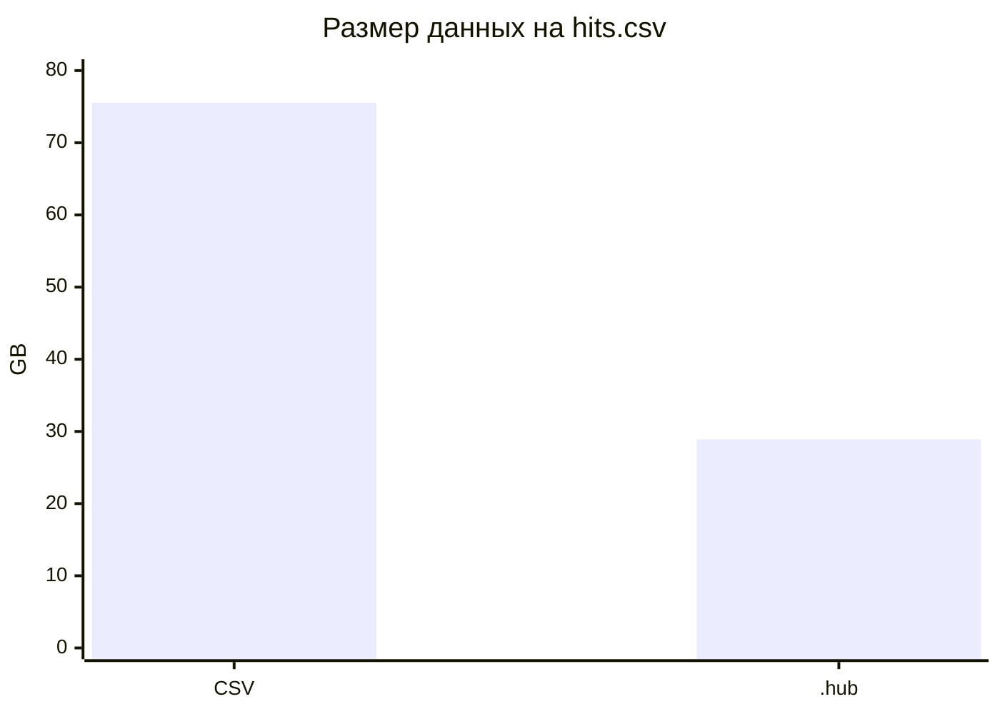
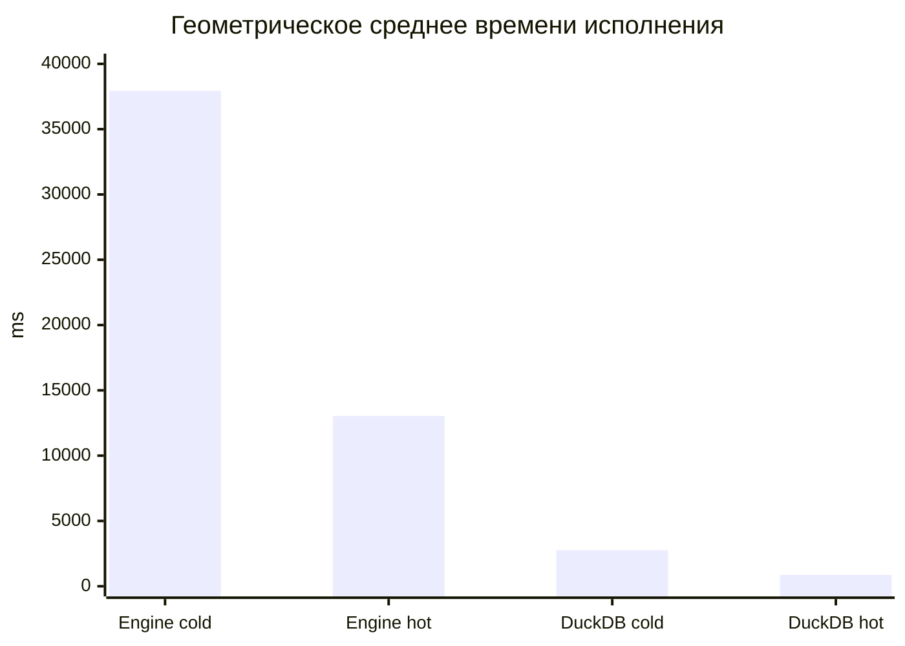

# ColumnarEngine
2nd year coursework

В данном репозитории предоставлен колоночный формат данных и простейший движок к нему. Движок ориентирован не более чем на выполнение запросов ClickBench. Семантика классов понятна из тестов SimpleTest. Приятного просмотра!

## Идея проекта

Основная идея проекта состояла в том, чтобы стандартизировать работу с колонками через единый низкоуровневый контейнер `ByteVector`. Вместо того чтобы для каждого типа данных держать отдельную сложную структуру, колонка хранит значения как последовательность байт, а типизированная логика находится выше.

Подход получился не идеальным: из-за владения данными внутри колонок и частых копирований сломалась нормальная векторизация, а часть операций стала тяжелее, чем могла бы быть в промышленном движке. Но метод имеет право на существование: он дает достаточно простую реализацию формата, чтения, записи, сжатия и ручной сборки запросов, что было важнее для курсового проекта, чем максимальная производительность любой ценой.

## Что сделано

- Собственный колоночный формат `.hub`.
- Конвертация CSV в `.hub` чанками, без необходимости держать весь файл в памяти.
- Единое представление данных колонок через `ByteVector`.
- Сжатие строковых колонок через dictionary encoding и bit-packing индексов.
- Сжатие числовых колонок через bit-packing.
- Чтение только нужных колонок через projection builder.
- Ускорение чтения через `mmap`.
- Выполнение всех 43 запросов ClickBench, заданных вручную в коде.
- Базовые операции аналитического движка: фильтрация, выражения, агрегации, группировка, `TopK`, `ORDER BY`, `OFFSET`, выбор колонок ответа.

## Структура проекта

- `src/data_structures` — базовые структуры данных: колонки, батчи, схема таблицы, метаданные и байтовый буфер.
- `src/io` — чтение и запись данных: CSV, колоночный формат, сканеры батчей.
- `src/operations` — операции над данными: фильтрация, агрегации, группировка, TopK, выражения и выбор колонок.
- `src/core` — верхний слой движка: `Engine`, `Pipeline` и построение проекций для чтения нужных колонок.
- `src/utils` — вспомогательные утилиты: описание колонок ClickBench/Hits и конвертация строк для CSV.
- `tests` — тесты проекта. В `tests/simple_tests` лежат минимальные примеры использования основных классов.
- `tests/fixtures` — данные и SQL-запросы для E2E-проверок.
- `sandbox` — маленькое приложение для ручного запуска и экспериментов.
- `script` — shell-скрипты для сборки, настройки, конвертации и запуска запросов.
- `build` — локальная директория сборки CMake; это не исходный код проекта.

## Сжатие

На большом `hits.csv` из ClickBench исходный CSV занимал 75.56 GB. После конвертации в `.hub` файл занял 28.91 GB.

Это улучшило размер хранения примерно в 2.61 раза и сэкономило около 61.7% места.

Сжатие сделано простым и предсказуемым. Для строк используется словарь уникальных значений внутри чанка, а сама колонка хранит только индексы в этот словарь. Индексы и числовые значения упаковываются минимальным числом бит. Для временных колонок delta-сжатие пока не реализовано.

Конвертация также работает потоково по чанкам: данные читаются из CSV, сразу раскладываются по колонкам, сжимаются и записываются в `.hub`. За счет этого процесс остается достаточно быстрым и не требует загрузки всего `hits.csv` в оперативную память.

## Производительность

Бенчмарк запускался на большом `hits.csv` из ClickBench. Для каждого запроса измерялся один холодный запуск и два горячих; в таблицах ниже горячее время — среднее двух горячих запусков.

Лучшая конфигурация проекта использует Boost-контейнеры и `mmap`.

| Конфигурация | Сумма cold, s | Сумма hot, s | Геометрическое среднее cold, ms | Геометрическое среднее hot, ms |
|---|---:|---:|---:|---:|
| Boost + mmap | 2209.45 | 1012.46 | 37939.96 | 13040.85 |
| Boost, без mmap | 2679.01 | 1097.15 | 47343.52 | 14238.35 |
| mmap, без Boost | 2495.56 | 1266.00 | 42292.67 | 15590.07 |
| DuckDB | 491.65 | 297.74 | 2761.05 | 870.47 |

По геометрическому среднему DuckDB быстрее текущей версии примерно в 13.74 раза на холодных запусках и в 14.98 раза на горячих. Это ожидаемо: DuckDB — промышленный векторизованный движок, а здесь главной целью была компактная реализация собственного формата и пайплайна.

Самый тяжелый запрос для текущего движка — `Q23`: 264537 ms на холодном запуске и 177629 ms на горячем. Для DuckDB самый тяжелый по hot-времени в этих замерах — `Q28`: 104246 ms.

### Времена запросов

| Q | Engine cold, ms | Engine hot avg, ms | DuckDB cold, ms | DuckDB hot avg, ms |
|---:|---:|---:|---:|---:|
| 0 | 7272 | 1029 | 27 | 0 |
| 1 | 8558 | 2276 | 462 | 56 |
| 2 | 17003 | 4246 | 1544 | 350 |
| 3 | 18431 | 6886 | 1945 | 511 |
| 4 | 22874 | 10238 | 6121 | 4586 |
| 5 | 19415 | 8952 | 7897 | 4708 |
| 6 | 12107 | 1682 | 71 | 2 |
| 7 | 8304 | 2253 | 480 | 82 |
| 8 | 29025 | 19396 | 7496 | 5190 |
| 9 | 47437 | 27345 | 10865 | 6782 |
| 10 | 28827 | 9740 | 4078 | 1598 |
| 11 | 30026 | 11130 | 3887 | 1718 |
| 12 | 22853 | 12218 | 6698 | 4158 |
| 13 | 46163 | 23764 | 10809 | 6361 |
| 14 | 31082 | 14707 | 7600 | 4342 |
| 15 | 39413 | 21494 | 6768 | 4622 |
| 16 | 61366 | 39750 | 15336 | 10172 |
| 17 | 61583 | 36596 | 15041 | 9764 |
| 18 | 131443 | 94470 | 27908 | 19360 |
| 19 | 20949 | 7894 | 1111 | 41 |
| 20 | 35301 | 8831 | 22349 | 7700 |
| 21 | 46740 | 10826 | 23594 | 6555 |
| 22 | 85087 | 19400 | 44796 | 6860 |
| 23 | 264537 | 177629 | 1988 | 631 |
| 24 | 28247 | 4453 | 415 | 134 |
| 25 | 16329 | 4456 | 174 | 47 |
| 26 | 28718 | 4448 | 531 | 138 |
| 27 | 55339 | 15537 | 22872 | 9780 |
| 28 | 61121 | 36170 | 109294 | 104246 |
| 29 | 8354 | 2514 | 1298 | 324 |
| 30 | 53321 | 18248 | 9342 | 4020 |
| 31 | 94887 | 27262 | 13421 | 4756 |
| 32 | 152947 | 104789 | 36981 | 31049 |
| 33 | 73597 | 46248 | 29931 | 15520 |
| 34 | 78788 | 49986 | 30019 | 16020 |
| 35 | 47268 | 32934 | 6673 | 5002 |
| 36 | 59605 | 9876 | 315 | 116 |
| 37 | 53204 | 9482 | 185 | 64 |
| 38 | 62210 | 10195 | 237 | 58 |
| 39 | 92731 | 24392 | 661 | 257 |
| 40 | 59346 | 16780 | 172 | 14 |
| 41 | 55533 | 14914 | 139 | 15 |
| 42 | 32106 | 7022 | 123 | 33 |

## Что можно улучшить

- Сделать невладеющие колонки, которые смотрят на память из `mmap` или на внешнюю арену, а не копируют данные при каждой операции.
- Переписать представление колонок с нестроковыми значениями на типизированные векторы, чтобы вернуть компилятору возможность нормальной векторизации.
- Для строк использовать `string_view` и отдельную арену только для новых строк, созданных выражениями.
- Добавить выбор стратегии сжатия по статистике колонки, чтобы dictionary encoding не применялся там, где уникальных строк слишком много.
- Реализовать delta-сжатие для дат и timestamp-колонок.
- Добавить SQL-парсер вместо ручного описания 43 запросов.
